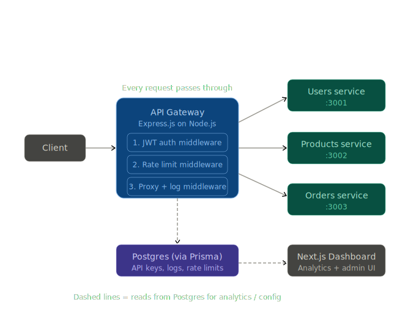

# Ingressor - API Gateway

A production-inspired API Gateway built from scratch. Handles authentication, rate limiting, request proxying, and analytics - the same core responsibilities as tools like Kong or AWS API Gateway.

Built with **Node.js**, **Express**, **TypeScript**, **Prisma**, **PostgreSQL (Neon)**, and a **Next.js** analytics dashboard.

---

# Architecture ERD


---

## What it does

Every request from a client passes through the gateway before reaching any downstream service. The gateway enforces three things on every request:

1. **Authentication** - validates the API key in the `x-api-key` header against hashed keys stored in Postgres
2. **Rate limiting** - tracks requests per minute using a sliding window counter per API key
3. **Proxying** - matches the request path to a registered route and forwards it to the correct downstream service

Every proxied request is logged asynchronously to Postgres. The Next.js dashboard reads these logs and displays live analytics.

---

## Tech stack

| Layer | Technology |
|---|---|
| Gateway server | Node.js, Express, TypeScript |
| ORM | Prisma 5 |
| Database | PostgreSQL via Neon (cloud-hosted) |
| Frontend | Next.js 14 (App Router), TypeScript |
| Charts | Recharts |
| Auth | bcrypt-hashed API keys |

---

## Database schema

Five tables. Each has a clear, single responsibility.

**`User`** - owns API keys and registered routes.

**`ApiKey`** - stores bcrypt-hashed keys. Raw keys are shown once on creation and never stored in plain text.

**`Route`** - maps a URL prefix (e.g. `/users`) to a downstream target URL (e.g. `http://localhost:3001`). Supports multiple routes per user.

**`RateLimit`** - one row per API key per minute window. Tracks request count against a configurable max. Uses Prisma `upsert` for atomic increments.

**`RequestLog`** - one row per proxied request. Stores method, path, status code, latency, IP, and user agent. Written asynchronously so it never blocks the response. Indexed on `(apiKeyId, createdAt)` and `(createdAt)` for fast dashboard queries.

---

## How a request flows

```
Client
  │
  │  GET /users
  │  x-api-key: gw_abc123
  ▼
Express Gateway :3000
  │
  ├─ 1. authMiddleware
  │     Checks x-api-key header
  │     Loads active keys from Postgres
  │     bcrypt.compare() against each
  │     Attaches matched key to req
  │
  ├─ 2. rateLimitMiddleware
  │     Floors timestamp to current minute
  │     Upserts RateLimit row (atomic increment)
  │     Sets X-RateLimit-* response headers
  │     Returns 429 if limit exceeded
  │
  ├─ 3. proxyMiddleware
  │     Loads routes for this user from Postgres
  │     Longest-prefix match against req.path
  │     Forwards request to matched targetUrl
  │     Strips x-api-key before forwarding
  │     Logs result to RequestLog (fire-and-forget)
  │
  ▼
Downstream Service :3001
  Returns response → gateway → client
```

---

## API reference

### Admin endpoints

All admin endpoints require the header:
```
x-admin-secret: <your-admin-secret>
```

#### Users

| Method | Endpoint | Description |
|---|---|---|
| `POST` | `/admin/users` | Create a new user |

Request body:
```json
{
  "email": "you@example.com",
  "name": "Your Name"
}
```

---

#### API keys

| Method | Endpoint | Description |
|---|---|---|
| `POST` | `/admin/api-keys` | Generate a new API key for a user |
| `DELETE` | `/admin/api-keys/:id` | Revoke an API key |

Generate key - request body:
```json
{
  "userId": "<user-id>",
  "name": "Dev key",
  "expiresAt": "2025-12-31T00:00:00Z"
}
```

Response includes `rawKey` - this is the only time the plain-text key is returned. Store it immediately.

---

#### Routes

| Method | Endpoint | Description |
|---|---|---|
| `POST` | `/admin/routes` | Register a new proxy route |
| `GET` | `/admin/routes` | List all registered routes |

Register route - request body:
```json
{
  "userId": "<user-id>",
  "prefix": "/users",
  "targetUrl": "http://localhost:3001"
}
```

---

### Gateway proxy

| Method | Endpoint | Description |
|---|---|---|
| `ALL` | `/*` | Proxy any request to the matched downstream service |

Required header:
```
x-api-key: gw_<your-raw-key>
```

Response headers set by the gateway:
```
X-RateLimit-Limit: 100
X-RateLimit-Remaining: 94
X-RateLimit-Reset: 2024-01-01T12:01:00.000Z
```

---

### Analytics endpoints

| Method | Endpoint | Description |
|---|---|---|
| `GET` | `/analytics/overview` | Total requests, error count, error rate, avg latency (last 24h) |
| `GET` | `/analytics/timeseries` | Request count grouped by hour (last 24h) |
| `GET` | `/analytics/top-routes` | Top 10 most called paths with avg latency |
| `GET` | `/analytics/recent` | Last 20 requests |

Sample response from `/analytics/overview`:
```json
{
  "totalRequests": 1284,
  "errorCount": 23,
  "errorRate": "1.79",
  "avgLatencyMs": 184
}
```

---

## Key design decisions

**Why bcrypt for API keys instead of JWT?**
API keys are long-lived credentials, not session tokens. bcrypt hashing means even if the database is compromised, raw keys are not exposed. The `gw_` prefix allows fast filtering before doing any hashing.

**Why fire-and-forget for request logging?**
Adding `await` to the log write would add database latency to every proxied request. Logging is best-effort - losing a few log entries on a crash is acceptable for an analytics use case.

**Why longest-prefix match for routing?**
This is how Nginx and Kubernetes Ingress controllers work. A request to `/users/profile` will match a `/users` route even if a broader `/` route also exists - the most specific match always wins.

**Why a sliding window for rate limiting?**
A fixed window (reset every minute on the clock) allows a burst of 2× the limit straddling a window boundary. A sliding window is fairer - the counter always represents the last 60 seconds of activity.

**Why Postgres for rate limit counters instead of Redis?**
Redis would be faster, but adds infrastructure complexity. Postgres with `upsert` handles this load comfortably up to ~1000 req/s. In a production system, you'd migrate counters to Redis while keeping config and logs in Postgres.

---

## What I might add next

- [ ] Circuit breaker per downstream service - prevent a slow service from blocking the gateway
- [ ] Request ID propagation - attach `x-request-id` for distributed tracing across services
- [ ] JWT auth as an alternative to API key auth
- [ ] Deploy gateway to Railway / IBM Code Engine
- [ ] Connect IBM Cloud Object Storage or IBM Event Streams for a cloud-native extension

---